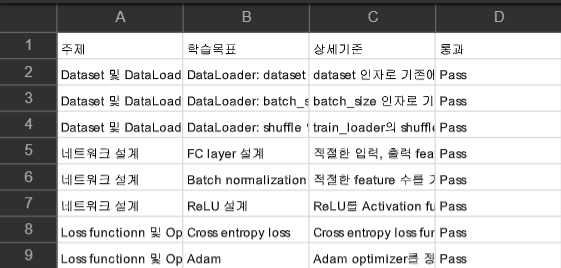

# Pytorch-Study
## 부스트코스 Pytorch 강의내용 정리

### Part 1. Machine Learning and Pytorch Basic

- [x] 1. Tensor Manipulation
- [x] 2. Linear regression
- [x] 3. Multivariate Linear Regression
- [x] 4. Loading Data
- [x] 5. Logistic Regression
- [x] 6. Softmax_Classification
- [x] 7. Tips
- [x] 7-1. MNIST_Introduction

### Part 2. Deep Neural Network
- [x] 8. Perceptron, Perceptron(xor-nn)
- [x] 9. ReLU
- [x] 9~1. Weight_initialization
- [x] 9~2. Dropout
- [x] 9~3. Batch_Normalization
- [x] Project A. Fashion MNIST Classifier

